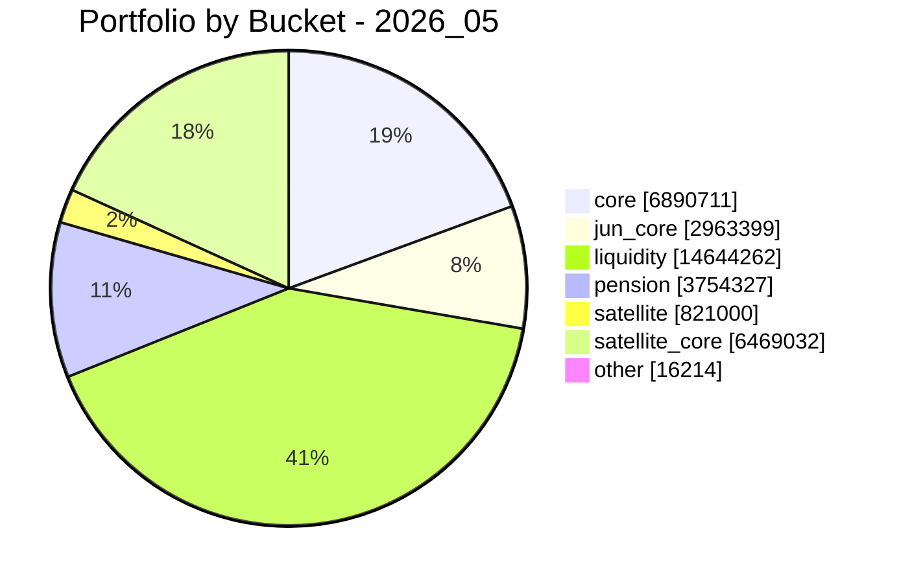
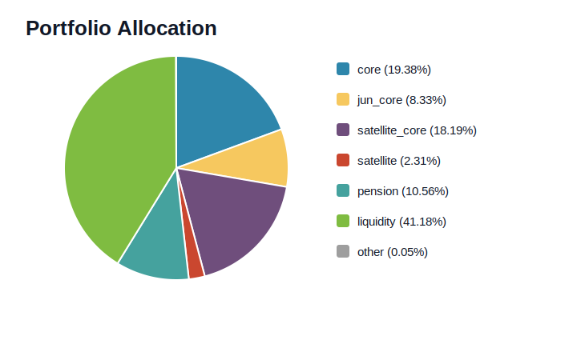

# Monthly Limit Order Review System

月次の資産スナップショット YAML を入力にして、ChatGPT 向けの月次レビュー用プロンプトと、Codex 向けの修正プロンプトを生成する Python CLI です。

本ツールは自動売買ツールではありません。Python が数値計算と履歴保存を担当し、ChatGPT が月次レビューと改善提案を担当し、最終判断と発注はユーザが手動で行います。

## Monthly Review: 2026_05

- snapshot_date: 2026-04-25
- total_assets_jpy: 35,558,948円

### Monthly Review Summary

- 2026年5月は core不足と現金過多を是正する月
- 固定積立がNISA枠枯渇により550,000円に低下
- その補填として coreスポット買いを900,000円に増額
- 5月のcore投入合計は1,450,000円
- SOX投信は買わない
- satellite_core は目標超過のため、テーマ追加は深い押し目限定
- 今月の優先順位は `core > MSFT押し目 > PLTR/URA深い押し目 > CIBR/SOX見送り`

### Purchase Plan

固定積立の実績見込みが 550,000円まで低下するため、5月のcore投入目標 1,450,000円を維持する目的で、スポット買いを 900,000円まで増額する。

| item | amount_jpy | note |
| --- | ---: | --- |
| 固定積立（当初想定） | 750,000 | 当初の5月想定 |
| 固定積立（実績見込み） | 550,000 | NISA枠の枯渇により今月は550,000円まで低下 |
| coreスポット買い | 900,000 | 固定積立の減少200,000円分を補填 |
| 5月のcore投入合計 | 1,450,000 | 固定積立550,000円 + スポット買い900,000円 |

| fund | amount_jpy |
| --- | ---: |
| eMAXIS Slim 全世界株式（オール・カントリー） | 550,000 |
| eMAXIS Slim 米国株式（S&P500） | 350,000 |
| **合計** | **900,000** |

| date | fund | amount_jpy |
| --- | --- | ---: |
| 2026-05-01 | eMAXIS Slim 全世界株式（オール・カントリー） | 150,000 |
| 2026-05-01 | eMAXIS Slim 米国株式（S&P500） | 100,000 |
| 2026-05-08 | eMAXIS Slim 全世界株式（オール・カントリー） | 150,000 |
| 2026-05-08 | eMAXIS Slim 米国株式（S&P500） | 100,000 |
| 2026-05-15 | eMAXIS Slim 全世界株式（オール・カントリー） | 150,000 |
| 2026-05-15 | eMAXIS Slim 米国株式（S&P500） | 100,000 |
| 2026-05-22 | eMAXIS Slim 全世界株式（オール・カントリー） | 100,000 |
| 2026-05-22 | eMAXIS Slim 米国株式（S&P500） | 50,000 |
| **合計** |  | **900,000** |

### Portfolio Summary

| bucket | market_value_jpy | actual_pct | target_pct | delta_pct |
| --- | ---: | ---: | ---: | ---: |
| core | 6,890,711 | 19.38% | 45.00% | -25.62pt |
| jun_core | 2,963,399 | 8.33% | 20.00% | -11.67pt |
| liquidity | 14,644,262 | 41.18% | 10.00% | +31.18pt |
| pension | 3,754,327 | 10.56% | - | - |
| satellite | 821,000 | 2.31% | 10.00% | -7.69pt |
| satellite_core | 6,469,032 | 18.19% | 15.00% | +3.19pt |
| other | 16,214 | 0.05% | - | - |

- core は目標45.00%に対して19.38%で、依然として大幅不足
- liquidity は41.18%で、目標10.00%を大きく上回る過大待機資金
- satellite_core は18.19%で目標15.00%を超過しているため、テーマETFやSOX追加より core 補強を優先する
- 半導体 direct exposure は13.83%
- direct + indirect AI infrastructure watch metric は15.14%
- 名古屋市中区・金山駅近くの流動性が高いマンションを住居兼資産として保有している一方、フルローン購入で返済初期のため、国内不動産への実質エクスポージャとレバレッジリスクがある
- そのため現金を一気に削りすぎず、ただし現在の流動性41.18%は明確に過大として扱う

### Mermaid Pie Chart



<!-- portfolio-piechart:start -->
## Latest Portfolio Snapshot

- snapshot_date: 2026-04-25
- total_assets_jpy: 35558948



| bucket | market_value_jpy | pct |
| --- | ---: | ---: |
| core | 6890711 | 19.38% |
| jun_core | 2963399 | 8.33% |
| satellite_core | 6469032 | 18.19% |
| satellite | 821000 | 2.31% |
| pension | 3754327 | 10.56% |
| liquidity | 14644262 | 41.18% |
| other | 16214 | 0.05% |
<!-- portfolio-piechart:end -->

## 目的

- 月初の指値設定を一貫したルールでレビューする
- ポートフォリオの偏りとリスク警告を毎月構造化して残す
- ChatGPT の改善提案を Codex 向けの編集粒度に落とし込む
- Python 候補値と ChatGPT 最終提案の差分を保存する

## 毎月のワークフロー

1. Money Forward の資産キャプチャを ChatGPT に貼る
2. [prompts/moneyforward_normalization_prompt.md](/Users/tappeiyoshida/Documents/stock/prompts/moneyforward_normalization_prompt.md) を使って YAML に正規化する
3. ChatGPT の返した YAML を `data/normalized/snapshot_YYYY_MM.yaml` という命名規約で保存する
4. 例として [data/normalized/snapshot_2026_03.yaml](/Users/tappeiyoshida/Documents/stock/data/normalized/snapshot_2026_03.yaml) の形式を使う
5. CLI で市場データ取得、比率計算、ルール計算、警告抽出を実行する
6. 生成された月次レビュー用プロンプトを ChatGPT に貼る
7. ChatGPT の回答をテキストで保存する
8. CLI でレビュー取り込み、差分保存、Codex 向け修正プロンプト生成を行う
9. 必要なら Codex に修正プロンプトを渡してスクリプトを改善する

## 役割分担

- Python: YAML ロード、`yfinance` 取得、20日平均、63日高値、バケット比率、警告、候補価格、差分保存、履歴保存
- ChatGPT: 今月の指値提案、SOX 投信判定、ポートフォリオ診断、改善提案、Codex 向け修正要約
- Codex: ChatGPT が出した改善点をコードとテストへ落とし込む

## セットアップ

```bash
python3 -m venv .venv
source .venv/bin/activate
python -m pip install -r requirements.txt
python -m pip install -e .
```

## Quick Start (ユーザ向け)

1. サンプル YAML をそのまま使って、まずは 1 回実行します

```bash
python -m monthly_limit_order_review.cli monthly-run \
  --snapshot data/normalized/snapshot_2026_03.yaml
```

2. 生成されたレビュー用プロンプトを ChatGPT に貼り、回答を保存します

- 保存先例: `data/history/reviews/chatgpt_review_2026_03.txt`

3. ChatGPT の回答を取り込み、差分と Codex 向け修正プロンプトを作成します

```bash
python -m monthly_limit_order_review.cli ingest-review \
  --snapshot data/normalized/snapshot_2026_03.yaml \
  --review-text data/history/reviews/chatgpt_review_2026_03.txt

python -m monthly_limit_order_review.cli generate-codex-patch \
  --snapshot data/normalized/snapshot_2026_03.yaml \
  --review-text data/history/reviews/chatgpt_review_2026_03.txt \
  --output prompts/generated/codex_patch_prompt_2026_03.md
```

4. 出力を確認します

- 月次レビュー用プロンプト: `prompts/generated/monthly_review_prompt_2026_03.md`
- 計算結果: `data/history/computations/2026_03_computation.yaml`
- 差分結果: `data/history/diffs/2026_03_python_vs_chatgpt.yaml`
- Codex 向け修正プロンプト: `prompts/generated/codex_patch_prompt_2026_03.md`

## 入力 YAML の作り方

- 画像 OCR は Python に入れず、ChatGPT に YAML 正規化だけをさせます
- ChatGPT はファイルを書かず、チャット上に YAML を返します。ユーザがそれを保存します
- 保存ファイル名は `snapshot_date` に合わせて `data/normalized/snapshot_YYYY_MM.yaml` とします
- 読み取れない値は `null` にします
- `asset_class` は `liquidity`, `core`, `jun_core`, `satellite_core`, `satellite`, `pension`, `other` のいずれかを付けます
- `currency_base` は原則 `JPY` を入れます
- サンプルは [data/normalized/snapshot_2026_03.yaml](/Users/tappeiyoshida/Documents/stock/data/normalized/snapshot_2026_03.yaml) を参照してください

## 主要コマンド

月次レビュー用プロンプト生成:

```bash
python -m monthly_limit_order_review.cli generate-review-prompt \
  --snapshot data/normalized/snapshot_2026_03.yaml \
  --output prompts/generated/monthly_review_prompt_2026_03.md
```

ChatGPT レビュー取り込み:

```bash
python -m monthly_limit_order_review.cli ingest-review \
  --snapshot data/normalized/snapshot_2026_03.yaml \
  --review-text data/history/reviews/chatgpt_review_2026_03.txt
```

Codex 向け修正プロンプト生成:

```bash
python -m monthly_limit_order_review.cli generate-codex-patch \
  --snapshot data/normalized/snapshot_2026_03.yaml \
  --review-text data/history/reviews/chatgpt_review_2026_03.txt \
  --output prompts/generated/codex_patch_prompt_2026_03.md
```

月次の計算とプロンプト生成をまとめて実行:

```bash
python -m monthly_limit_order_review.cli monthly-run \
  --snapshot data/normalized/snapshot_2026_03.yaml
```

## 生成物一覧

- 月次レビュー用プロンプト: [prompts/generated/monthly_review_prompt_2026_03.md](/Users/tappeiyoshida/Documents/stock/prompts/generated/monthly_review_prompt_2026_03.md)
- Codex 向け修正プロンプト: [prompts/generated/codex_patch_prompt_2026_03.md](/Users/tappeiyoshida/Documents/stock/prompts/generated/codex_patch_prompt_2026_03.md)
- 計算結果: [data/history/computations/2026_03_computation.yaml](/Users/tappeiyoshida/Documents/stock/data/history/computations/2026_03_computation.yaml)
- 差分結果: [data/history/diffs/2026_03_python_vs_chatgpt.yaml](/Users/tappeiyoshida/Documents/stock/data/history/diffs/2026_03_python_vs_chatgpt.yaml)
- Codex 修正要求: [data/history/codex_patch_requests/2026_03_codex_patch_request.yaml](/Users/tappeiyoshida/Documents/stock/data/history/codex_patch_requests/2026_03_codex_patch_request.yaml)

## 履歴ファイルの説明

- `data/history/snapshots/`: 月次スナップショットの保管先
- `data/history/computations/`: Python の市場参照、候補値、警告
- `data/history/prompts/`: 毎月生成したレビュー用プロンプト
- `data/history/reviews/`: ChatGPT レビュー原文と構造化レビュー
- `data/history/diffs/`: Python 候補と ChatGPT 提案の差分
- `data/history/codex_patch_requests/`: 改善提案を編集粒度に整理した要求

## 差分保存の意味

- 毎月の判断を感覚論にしないため
- ChatGPT がどう候補を上書きしたかを蓄積するため
- 次の Codex 修正要求を具体化するため

## テスト

```bash
.venv/bin/python -m pytest -q
```

## 注意事項

- 最終判断は人間が行います
- 発注は人間が証券会社で手動で行います
- 本ツールは助言補助と構造化補助のための CLI です
- 自動発注、証券会社 API 接続、ブラウザ自動操作は実装していません
