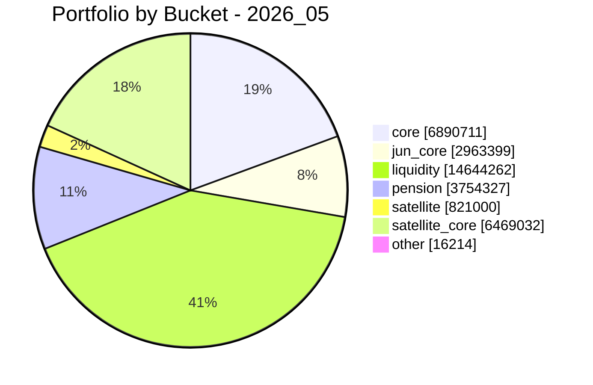
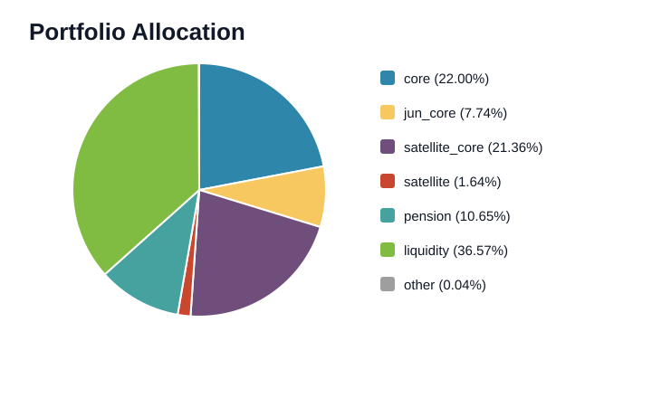

# Monthly Limit Order Review System

Codex が Money Forward キャプチャを直接読み取り・正規化した月次の資産スナップショット YAML を入力にして、ChatGPT 向けの月次レビュー用プロンプトと、Codex 向けの修正プロンプトを生成する Python CLI です。

本ツールは自動売買ツールではありません。Codex がキャプチャ読取と YAML 正規化、Python が数値計算と履歴保存、ChatGPT が構造化済みデータに対する月次レビューと改善提案を担当し、最終判断と発注はユーザが手動で行います。ChatGPT に Money Forward キャプチャを読ませ、その結果を Codex がドキュメント化する運用は行いません。

## Codex Responsibility Gate

Codex は投資判断者ではありません。Money Forwardキャプチャを扱う月次セッションでは、Codex の責務は以下に限定します。

- Money ForwardキャプチャやCSV等の入力データを正規化する
- 資産クラス、口座種別、銘柄名、数量、評価額、損益などを構造化する
- 入力データの欠損・表記ゆれ・不明点を検出する
- ChatGPTに渡す投資判断依頼プロンプトを作成する
- ChatGPTから返ってきた内容を、ユーザが明示的に貼り付けた場合のみ、レポジトリ内のアセットへ反映する
- プロンプト、フォーマット、チェックリスト、正規化スクリプトを改善する
- 投資判断に必要な材料を整理する

Codex は以下をしてはいけません。

- 買い・売り・保有・利確・損切り・積立停止・リバランスなどの投資判断を確定する
- 「おすすめ」「判断」「結論」「実行すべき」などの形で投資助言を完結する
- ChatGPTを介さずに投資判断を生成する
- ChatGPTの出力がない状態で、投資判断をレポジトリアセットへ反映する
- 正規化結果から自動的に売買方針を導く
- ユーザが明示していない投資方針を補完して決定する
- 月次レビューのChatGPTフィードバックループを省略する

Codex は、Money Forwardキャプチャの正規化、ChatGPT向け投資判断依頼プロンプトの作成、または投資判断が必要な論点整理が完了した時点で停止し、ユーザにChatGPTへの貼り付けを促します。この時点で出力してよいものは、正規化済みデータ、不明点・欠損・注意点、ChatGPTに貼り付けるためのプロンプト、ChatGPTに確認してほしい論点、Codex側プロンプトや運用ルール改善の相談事項だけです。

ユーザがChatGPTの出力を明示的に貼り付けた後にのみ、Codex はChatGPTの投資判断を記録フォーマットへ転記し、ChatGPTからの改善提案をAIアセットへ反映し、次回の月次レビュー用プロンプトを改善できます。ChatGPTの結論をCodexが独自に上書きしてはいけません。

### Failure Example

- 問題: Codex が Money Forwardキャプチャの正規化タスクから勝手に投資判断へ進み、ChatGPTを介さずにアセット更新まで完結した。
- 原因: Codex の責務境界、禁止事項、ハンドオフ条件、ChatGPTフィードバックゲートが十分に明文化されていなかった、またはCodexがそれを優先制約として扱わなかった。
- 再発防止: 投資判断を必要とする箇所では、Codex は必ずChatGPT向けプロンプトを作成して停止する。ChatGPT出力がユーザから貼り付けられるまで、判断・反映・最適化を進めない。

## Human Quick Start: Codex Session Prompt

Money Forward月次レビューを始めるときは、Codexの新規セッション冒頭に以下をそのまま貼り付けてください。

```md
あなたはこの `stock` レポジトリのAIアセット保守・月次レビュー準備担当です。

今回のタスク種別は、以下のうちどれかを最初に判定して宣言してください。

1. Money Forwardキャプチャの正規化
2. ChatGPT向け月次レビュー依頼プロンプトの作成
3. ユーザが貼り付けたChatGPT出力の反映
4. AIアセット・プロンプト・運用ルールの改善

今回、ユーザがChatGPTの月次レビュー出力を明示的に貼り付けていない場合、Codexは投資判断をしてはいけません。

## Codexの責務

Codexが行ってよいこと:

- Money ForwardキャプチャをOCR・正規化する
- `data/normalized/snapshot_YYYY_MM.yaml` を作成または更新する
- 欠損、不明点、OCR不確実性、前月差分、分類ミス候補を整理する
- CLIで検証・計算・ChatGPT向け月次レビュー依頼プロンプトを生成する
- 生成したプロンプトをユーザに提示する
- ChatGPTに確認してほしい論点を整理する

## 禁止事項

Codexは以下をしてはいけません。

- 買い、売り、保有、利確、損切り、積立停止、リバランスを確定する
- 購入額、指値、優先順位をCodex自身の結論として提示する
- ChatGPTを介さずに投資判断を生成する
- ChatGPT出力がない状態でREADME、月次サマリー、購入計画、指値設定を更新する
- 「おすすめ」「結論」「実行すべき」という形で投資助言を完結する
- 正規化タスクから投資判断タスクへ勝手に進む

## 必ず最初に読むもの

作業前に以下を確認してください。

- `README.md`
- `SPEC.md`
- `prompts/templates/moneyforward_monthly_session_start_prompt.md`
- `prompts/moneyforward_normalization_prompt.md`
- 直近の `data/normalized/snapshot_YYYY_MM.yaml`
- 必要に応じて `config/` 配下のルール

## 実施手順

1. `git status` を確認する
2. 既存AIアセットの責務境界を確認する
3. Money Forwardキャプチャを一次情報として正規化する
4. 既存スナップショットと照合する
5. 不明点・警告・検証結果を残す
6. CLIでChatGPT向け月次レビュー依頼プロンプトを生成する
7. 生成物と注意点をユーザに報告する
8. そこで停止する

## ハンドオフ条件

以下のいずれかに到達したら、Codexは停止してください。

- 正規化済みスナップショットができた
- ChatGPT向け月次レビュー依頼プロンプトができた
- 投資判断が必要な論点を整理し終えた

停止時に出力してよいもの:

- 作成・更新したファイル
- 正規化結果の要約
- 不明点・欠損・注意点
- ChatGPTに貼り付けるプロンプト
- ChatGPTに確認してほしい論点

この先の投資判断はCodexが行わず、ユーザがChatGPTに貼り付けるまで待ってください。
```

## Monthly Review: 2026_05

- snapshot_date: 2026-04-25
- total_assets_jpy: 35,558,948円

### Monthly Review Summary

- 2026年5月は core不足と現金過多を是正する月
- 現在の固定積立は、NISAつみたて投資枠100,000円/月、iDeCoオルカン55,000円/月、BTC/ETH各2,000円/週
- 5月のスポット購入は、上記の既存積立を差し引いた特定口座coreスポット買い1,280,000円にする
- 5月のcore投入合計は1,380,000円（NISA固定core積立100,000円 + coreスポット買い1,280,000円）
- SOX投信は買わない
- satellite_core は目標超過のため、テーマ追加は深い押し目限定
- 今月の優先順位は `core > MSFT押し目 > PLTR/URA深い押し目 > CIBR/SOX見送り`

### Purchase Plan

固定core積立は NISAつみたて投資枠の100,000円/月として扱う。iDeCoのオルカン55,000円/月は pension、BTC/ETH各2,000円/週は暗号資産の継続積立として別枠で把握する。5月の総投資額は、NISA 100,000円 + iDeCo 55,000円 + BTC/ETH 16,000円（4週分） + 特定口座coreスポット買い1,280,000円 = 1,451,000円を目安にする。

| item | amount_jpy | note |
| --- | ---: | --- |
| NISA固定core積立 | 100,000 | NISAつみたて投資枠 |
| iDeCoオルカン積立 | 55,000 | pensionとして別枠で把握 |
| BTC/ETH週次積立 | 4,000 / week | BTC 2,000円/週 + ETH 2,000円/週 |
| coreスポット買い | 1,280,000 | 既存積立を差し引いた特定口座での追加購入 |
| 5月のcore投入合計 | 1,380,000 | NISA固定core積立100,000円 + coreスポット買い1,280,000円 |
| 5月の総投資額 | 1,451,000 | core投入1,380,000円 + iDeCo55,000円 + BTC/ETH16,000円 |

| fund | amount_jpy |
| --- | ---: |
| eMAXIS Slim 全世界株式（オール・カントリー） | 768,000 |
| eMAXIS Slim 米国株式（S&P500） | 512,000 |
| **合計** | **1,280,000** |

| date | fund | amount_jpy |
| --- | --- | ---: |
| 2026-05-01 | eMAXIS Slim 全世界株式（オール・カントリー） | 192,000 |
| 2026-05-01 | eMAXIS Slim 米国株式（S&P500） | 128,000 |
| 2026-05-08 | eMAXIS Slim 全世界株式（オール・カントリー） | 192,000 |
| 2026-05-08 | eMAXIS Slim 米国株式（S&P500） | 128,000 |
| 2026-05-15 | eMAXIS Slim 全世界株式（オール・カントリー） | 192,000 |
| 2026-05-15 | eMAXIS Slim 米国株式（S&P500） | 128,000 |
| 2026-05-22 | eMAXIS Slim 全世界株式（オール・カントリー） | 192,000 |
| 2026-05-22 | eMAXIS Slim 米国株式（S&P500） | 128,000 |
| **合計** |  | **1,280,000** |

### Limit Buy Settings

core補強を最優先にし、テーマ銘柄は深い押し目だけを対象にする。satellite_core は目標超過のため、CIBR と SOX 投信は見送り、URA は深い押し目限定にする。

| target | limit setting | shares | status | note |
| --- | ---: | ---: | --- | --- |
| MSFT | 366.28 USD | 1 | set | jun_core 補強候補。ただし core スポット買いを優先 |
| MSFT | 350.69 USD | 2 | set | 深めの押し目 |
| MSFT | 319.52 USD | 2 | set | 大きな押し目 |
| PLTR | 124.20 USD | 2 | set | 高ボラ銘柄のため深い押し目限定 |
| PLTR | 113.98 USD | 2 | set | さらに深い押し目 |
| URA | 43.19 USD | 2 | set | satellite_core 目標超過のため深い押し目限定 |
| CIBR | - | - | skip | satellite_core 目標超過のため今月は見送り |
| SOX投信 | - | - | skip | satellite_core 目標超過、core 補強優先のため買わない |

### Portfolio Summary

| bucket | market_value_jpy | actual_pct | target_pct | delta_pct |
| --- | ---: | ---: | ---: | ---: |
| core | 6,890,711 | 19.38% | 45.00% | -25.62pt |
| jun_core | 2,963,399 | 8.33% | 20.00% | -11.67pt |
| liquidity | 14,644,262 | 41.18% | 10.00% | +31.18pt |
| pension | 3,754,327 | 10.56% | - | - |
| satellite | 821,000 | 2.31% | 10.00% | -7.69pt |
| satellite_core | 6,469,032 | 18.19% | 15.00% | +3.19pt |
| other | 16,214 | 0.05% | - | - |

- core は目標45.00%に対して19.38%で、依然として大幅不足
- liquidity は41.18%で、目標10.00%を大きく上回る過大待機資金
- satellite_core は18.19%で目標15.00%を超過しているため、テーマETFやSOX追加より core 補強を優先する
- 半導体 direct exposure は13.83%
- direct + indirect AI infrastructure watch metric は15.14%
- 名古屋市中区・金山駅近くの流動性が高いマンションを住居兼資産として保有している一方、フルローン購入で返済初期のため、国内不動産への実質エクスポージャとレバレッジリスクがある
- そのため現金を一気に削りすぎず、ただし現在の流動性41.18%は明確に過大として扱う

### Mermaid Pie Chart


```mermaid
pie showData
    title Portfolio by Bucket - 2026_05
    "core" : 6890711
    "jun_core" : 2963399
    "liquidity" : 14644262
    "pension" : 3754327
    "satellite" : 821000
    "satellite_core" : 6469032
    "other" : 16214
```

## Monthly Purchase Policy: 2026_05 to 2026_12

2026年5月〜12月は、2026年NISA成長投資枠枯渇により、core固定積立はNISAつみたて投資枠100,000円/月のみとして扱う。

| item | amount_jpy | account | note |
| --- | ---: | --- | --- |
| eMAXIS Slim 全世界株式（オール・カントリー） | 50,000 | NISAつみたて投資枠 | 固定core積立 |
| eMAXIS Slim 米国株式（S&P500） | 50,000 | NISAつみたて投資枠 | 固定core積立 |
| **固定core積立合計** | **100,000** |  | NISA成長投資枠750,000円/月は前提にしない |

| item | amount | account | note |
| --- | ---: | --- | --- |
| eMAXIS Slim 全世界株式（オール・カントリー） | 55,000円/月 | iDeCo | pensionとして別枠で把握 |
| BTC | 2,000円/週 | 暗号資産 | 既存の週次積立 |
| ETH | 2,000円/週 | 暗号資産 | 既存の週次積立 |

core不足と現金過多が続く限り、NISA成長投資枠の不足分は特定口座でのcoreスポット買いを厚くして補う。税効率はNISAより落ちるが、2026年5月〜12月の主問題は税効率ではなく、core不足と現金過多による基本配分の歪みである。

| mode | core spot buy range | condition |
| --- | ---: | --- |
| Normal | 300,000〜600,000円 | core不足はあるが現金過多が軽度、または相場が高値圏 |
| Aggressive | 700,000〜1,000,000円 | core不足が大きく、liquidity が target を大きく上回る |
| Rebalance | 1,000,000〜1,500,000円 | core_delta_pct が -25pt 程度以下、cash_excess_pct が +25pt 程度以上 |

Rebalance mode では、固定core積立100,000円 + 特定口座coreスポット買い1,280,000円 = 月次core投入1,380,000円を目安にする。iDeCo55,000円/月とBTC/ETH週次積立もキャッシュアウトとして別枠で考慮し、総投資額は月145万円程度を目安にする。ただし単月のcoreスポット買いは原則1,500,000円を上限とし、住宅ローン・生活防衛資金・大口支出不明リスクを考慮して現金を一気に削りすぎない。

coreスポット買いの配分は既存core商品に限定し、基本は eMAXIS Slim 全世界株式（オール・カントリー）60% / eMAXIS Slim 米国株式（S&P500）40% とする。米国株・半導体・AIインフラ感応度が高い月は、オルカン65% / S&P500 35% などオルカンを厚めにする。

<!-- portfolio-piechart:start -->
## Latest Portfolio Snapshot

- snapshot_date: 2026-04-25
- total_assets_jpy: 35558948



| bucket | market_value_jpy | pct |
| --- | ---: | ---: |
| core | 6890711 | 19.38% |
| jun_core | 2963399 | 8.33% |
| satellite_core | 6469032 | 18.19% |
| satellite | 821000 | 2.31% |
| pension | 3754327 | 10.56% |
| liquidity | 14644262 | 41.18% |
| other | 16214 | 0.05% |
<!-- portfolio-piechart:end -->

## 目的

- 月初の指値設定を一貫したルールでレビューする
- ポートフォリオの偏りとリスク警告を毎月構造化して残す
- ChatGPT の改善提案を Codex 向けの編集粒度に落とし込む
- Python 候補値と ChatGPT 最終提案の差分を保存する
- README の当月セクションには、月次サマリー、購入計画、今月の指値買い設定、ポートフォリオサマリーを見やすい順序で残す

## 毎月のワークフロー

1. ユーザが Codex セッションに Money Forward のスクリーンショットを添付する
2. 必要に応じて、Money Forward の画面からコピーしたテキストも Codex に貼る
3. Codex が [prompts/moneyforward_normalization_prompt.md](/Users/tappeiyoshida/Documents/stock/prompts/moneyforward_normalization_prompt.md) のルールに従い、スクリーンショットを一次情報として OCR・正規化する
4. Codex が `data/normalized/snapshot_YYYY_MM.yaml` を作成または更新する
5. 例として [data/normalized/snapshot_2026_03.yaml](/Users/tappeiyoshida/Documents/stock/data/normalized/snapshot_2026_03.yaml) の形式を使う
6. Codex / CLI が合計、カテゴリ、通貨、分類、前月差分、重複、OCR由来の不確実性を検証する
7. CLI で市場データ取得、比率計算、ルール計算、警告抽出を実行する
8. 生成された月次レビュー用プロンプトだけを ChatGPT に貼る。Money Forward のスクリーンショットや OCR 前の貼り付けテキストは ChatGPT に渡さない
9. ChatGPT が Codex / CLI で検証済みの構造化データを前提に、月次レビューと購入提案を返す
10. ChatGPT の回答をテキストで保存する
11. CLI でレビュー取り込み、差分保存、Codex 向け修正プロンプト生成を行う
12. ユーザがChatGPT出力またはCodex向け修正プロンプトを明示的に貼り付けた場合のみ、Codex がREADME の当月セクションに月次サマリー、購入計画、今月の指値買い設定、ポートフォリオサマリーを反映する

将来の月次レビュー開始時は [prompts/templates/moneyforward_monthly_session_start_prompt.md](/Users/tappeiyoshida/Documents/stock/prompts/templates/moneyforward_monthly_session_start_prompt.md) を Codex に貼り、スクリーンショット添付から始める。

## 役割分担

- Python: YAML ロード、`yfinance` 取得、20日平均、63日高値、バケット比率、警告、候補価格、差分保存、履歴保存
- Codex: Money Forward スクリーンショットの OCR、補助テキストとの照合、YAML 正規化、検証警告の整理、ChatGPT 向け月次レビュープロンプト生成、ユーザが明示的に貼り付けたChatGPT出力に基づくコードとテストへの反映
- ChatGPT: Codex / CLI で正規化・検証済みの数値を前提にした今月の指値提案、SOX 投信判定、ポートフォリオ診断、購入提案、改善提案、Codex 向け修正要約。Money Forward キャプチャ読取、OCR、YAML 作成は担当しない

Codex は、ChatGPT出力がない状態で月次サマリー、購入計画、指値設定、売買方針、ルール改善を確定または反映してはいけません。

## セットアップ

```bash
python3 -m venv .venv
source .venv/bin/activate
python -m pip install -r requirements.txt
python -m pip install -e .
```

## Quick Start (ユーザ向け)

1. サンプル YAML をそのまま使って、まずは 1 回実行します

```bash
python -m monthly_limit_order_review.cli monthly-run \
  --snapshot data/normalized/snapshot_2026_03.yaml
```

2. 生成されたレビュー用プロンプトを ChatGPT に貼り、回答を保存します

- 保存先例: `data/history/reviews/chatgpt_review_2026_03.txt`

3. ChatGPT の回答を取り込み、差分と Codex 向け修正プロンプトを作成します

```bash
python -m monthly_limit_order_review.cli ingest-review \
  --snapshot data/normalized/snapshot_2026_03.yaml \
  --review-text data/history/reviews/chatgpt_review_2026_03.txt

python -m monthly_limit_order_review.cli generate-codex-patch \
  --snapshot data/normalized/snapshot_2026_03.yaml \
  --review-text data/history/reviews/chatgpt_review_2026_03.txt \
  --output prompts/generated/codex_patch_prompt_2026_03.md
```

4. 出力を確認します

- 月次レビュー用プロンプト: `prompts/generated/monthly_review_prompt_2026_03.md`
- 計算結果: `data/history/computations/2026_03_computation.yaml`
- 差分結果: `data/history/diffs/2026_03_python_vs_chatgpt.yaml`
- Codex 向け修正プロンプト: `prompts/generated/codex_patch_prompt_2026_03.md`

## 入力 YAML の作り方

- Codex が Money Forward スクリーンショットを OCR し、既存スナップショット形式へ正規化します
- キャプチャ読取と正規化は Codex セッション内で完結させ、ChatGPT には正規化後のレビュー用プロンプトだけを渡します
- Money Forward からコピーしたテキストは補助情報として扱います。HTML/web view 由来のコピーは、レイアウト、列、階層、並び順、カテゴリとの対応が崩れる可能性があります
- 金額と項目の対応、口座区分、カテゴリ、並び順はスクリーンショットを優先して確定します
- 画像とテキストが矛盾する場合は、原則として画像を優先し、矛盾を `ocr_notes` または `validation_notes` に残します
- 保存ファイル名は `snapshot_date` に合わせて `data/normalized/snapshot_YYYY_MM.yaml` とします
- 読み取れない値は `null` にします
- 推測した値は `notes`、`ocr_notes`、`validation_notes` のいずれかで推測であることを明示します
- `asset_class` は `liquidity`, `core`, `jun_core`, `satellite_core`, `satellite`, `pension`, `other` のいずれかを付けます
- `currency_base` は原則 `JPY` を入れます
- サンプルは [data/normalized/snapshot_2026_03.yaml](/Users/tappeiyoshida/Documents/stock/data/normalized/snapshot_2026_03.yaml) を参照してください

## Evidence Priority

1. Money Forward スクリーンショット / 画像: 資産名、金額、カテゴリ、口座ラベル、視覚的な grouping の一次情報
2. 既存リポジトリデータ / 前月スナップショット: 継続性、資産同一性、既存分類、月次差分の異常検知
3. Money Forward から貼り付けられたテキスト: ラベルや数字の確認用の補助情報。レイアウト、順序、階層、列対応は信用しない
4. 推測: 必要な場合のみ使い、推測であることを明示する。不明値を黙って補完しない

## OCR Normalization Fields

Money Forward スクリーンショットから読み取れる範囲で以下を残す。

- `snapshot_date`
- `currency_base`
- `total_assets_jpy`
- `category_totals_jpy`
- `source_evidence`
- `ocr_notes`
- `validation_notes`
- holdings ごとの `symbol`, `name`, `source_category`, `institution`, `account_type`, `asset_class`, `quantity`, `avg_cost`, `current_price`, `unit_price`, `profit_loss_jpy`, `valuation_jpy`, `market_value_jpy`, `currency`, `notes`

`category_totals_jpy` は、Money Forward 画面上のカテゴリ名を使う場合は holdings の `source_category` と対応させる。リポジトリ分類で合計する場合は `asset_class` と対応させる。

読み取れない項目は `null` にする。同一ファンドや資産は、既存ルールが明示しない限り合算しない。

## Snapshot Validation

月次レビュー用プロンプトを生成する前に、少なくとも以下を確認する。

- `total_assets_jpy` と holdings の合計が大きく矛盾していないか
- `category_totals_jpy` がある場合、カテゴリ合計と該当 holdings 合計が大きく矛盾していないか
- `currency_base` と holdings の `currency` が想定範囲か
- 前月存在した資産が不自然に消えていないか
- 同一資産の月次増減が異常に大きくないか
- OCR や貼り付けテキスト由来の重複がないか
- NISA / 特定 / 年金 / 現金 / 預金の分類が `asset_class` と矛盾していないか
- core / satellite / pension / liquidity の扱いが既存ルールと矛盾していないか

検証警告は必ず ChatGPT 月次レビュー依頼プロンプトの警告一覧に含める。警告は常に出力をブロックするものではないが、投資判断に影響する曖昧さはユーザ確認または明示警告の対象にする。

## 主要コマンド

月次レビュー用プロンプト生成:

```bash
python -m monthly_limit_order_review.cli generate-review-prompt \
  --snapshot data/normalized/snapshot_2026_03.yaml \
  --output prompts/generated/monthly_review_prompt_2026_03.md
```

ChatGPT レビュー取り込み:

```bash
python -m monthly_limit_order_review.cli ingest-review \
  --snapshot data/normalized/snapshot_2026_03.yaml \
  --review-text data/history/reviews/chatgpt_review_2026_03.txt
```

Codex 向け修正プロンプト生成:

```bash
python -m monthly_limit_order_review.cli generate-codex-patch \
  --snapshot data/normalized/snapshot_2026_03.yaml \
  --review-text data/history/reviews/chatgpt_review_2026_03.txt \
  --output prompts/generated/codex_patch_prompt_2026_03.md
```

月次の計算とプロンプト生成をまとめて実行:

```bash
python -m monthly_limit_order_review.cli monthly-run \
  --snapshot data/normalized/snapshot_2026_03.yaml
```

## 生成物一覧

- 月次レビュー用プロンプト: [prompts/generated/monthly_review_prompt_2026_03.md](/Users/tappeiyoshida/Documents/stock/prompts/generated/monthly_review_prompt_2026_03.md)
- Codex 向け修正プロンプト: [prompts/generated/codex_patch_prompt_2026_03.md](/Users/tappeiyoshida/Documents/stock/prompts/generated/codex_patch_prompt_2026_03.md)
- 計算結果: [data/history/computations/2026_03_computation.yaml](/Users/tappeiyoshida/Documents/stock/data/history/computations/2026_03_computation.yaml)
- 差分結果: [data/history/diffs/2026_03_python_vs_chatgpt.yaml](/Users/tappeiyoshida/Documents/stock/data/history/diffs/2026_03_python_vs_chatgpt.yaml)
- Codex 修正要求: [data/history/codex_patch_requests/2026_03_codex_patch_request.yaml](/Users/tappeiyoshida/Documents/stock/data/history/codex_patch_requests/2026_03_codex_patch_request.yaml)

## 履歴ファイルの説明

- `data/history/snapshots/`: 月次スナップショットの保管先
- `data/history/computations/`: Python の市場参照、候補値、警告
- `data/history/prompts/`: 毎月生成したレビュー用プロンプト
- `data/history/reviews/`: ChatGPT レビュー原文と構造化レビュー
- `data/history/diffs/`: Python 候補と ChatGPT 提案の差分
- `data/history/codex_patch_requests/`: 改善提案を編集粒度に整理した要求

## 差分保存の意味

- 毎月の判断を感覚論にしないため
- ChatGPT がどう候補を上書きしたかを蓄積するため
- 次の Codex 修正要求を具体化するため

## テスト

```bash
.venv/bin/python -m pytest -q
```

## 注意事項

- 最終判断は人間が行います
- 発注は人間が証券会社で手動で行います
- 本ツールは助言補助と構造化補助のための CLI です
- 自動発注、証券会社 API 接続、ブラウザ自動操作は実装していません
